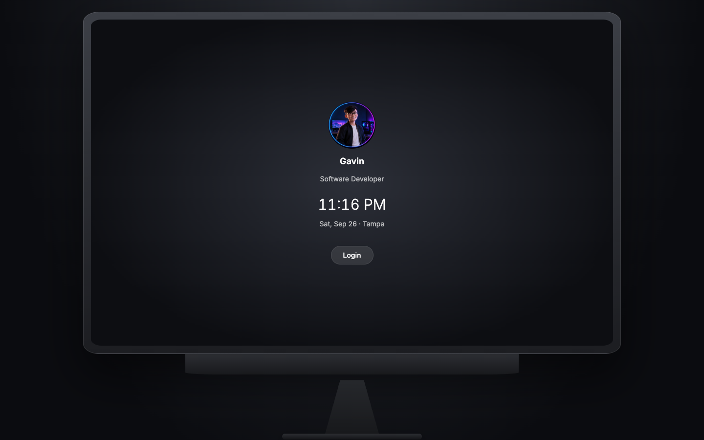
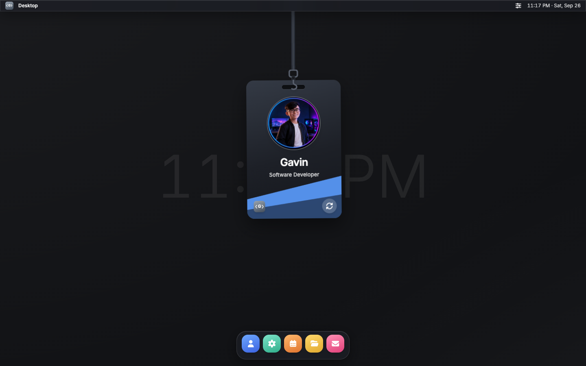
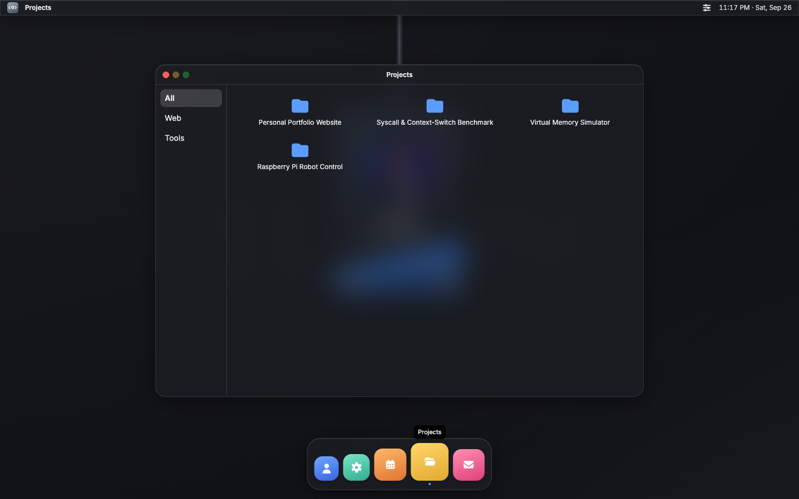

<div align="center">

# Gavin Le — Interactive Portfolio

**A personal portfolio that feels like sitting down at a desktop computer.**
Log in, watch the boot screen, and explore a windowed desktop with a hanging ID card.

[**Live site → gavinle.com**](https://gavinle.com)






</div>

## Overview

Instead of a scrolling page, visitors get a small interactive world: a lock screen on a
space-gray computer, a boot sequence, a zoom into a full-screen glass-style desktop, and five
apps in a dock. The whole thing is a static single-page app with no backend, no analytics,
and no third-party requests at runtime.

The visual style is _inspired by_ modern desktop operating systems but is an original design.
It uses no Apple assets, names, logos, or fonts, and it is not affiliated with or endorsed by
Apple. See [`PROJECT_BRIEF.md`](PROJECT_BRIEF.md) for the full spec and legal guardrails.

## Features

- **Cinematic entry:** lock screen, boot progress bar, and a smooth zoom from the hardware
  view into the desktop (and back again on Log Out).
- **Desktop shell:** animated wallpaper, menu bar with a logo menu and Control Center
  (appearance, brightness, language), live clock, and a dock with hover magnification.
- **Five draggable windows:** About me, Skills, Experience, Projects, and Contact. One window
  at a time, constrained to the desktop area.
- **Physics-based ID card:** a lanyard badge drops in after login and swings under real
  gravity. Grab it, drag it, let go, and it swings back to rest. Flip it for contact details.
  The simulation is a small dependency-free Verlet rope in [`src/utils/lanyard.ts`](src/utils/lanyard.ts).
- **Bilingual:** English and Vietnamese, switchable instantly without a reload.
- **Dark and light themes:** persisted across visits, along with the language choice.
- **Phone layout:** on phones the hardware frame is dropped in favor of a home
  screen with app icons and full-screen sheets.
- **Accessible:** keyboard navigation, focus management, ARIA roles for menus and dialogs,
  and full `prefers-reduced-motion` support (crossfades instead of zooms, a still ID card).

## Tech stack

| Area      | Choice                                                                      |
| --------- | --------------------------------------------------------------------------- |
| Framework | React 19 + TypeScript (strict)                                              |
| Build     | Vite                                                                        |
| Styling   | Tailwind CSS 4 with CSS-variable design tokens for theming                  |
| Animation | [Motion](https://motion.dev) (springs, drag, layout) + a custom physics sim |
| Icons     | Font Awesome (individually imported for tree-shaking)                       |
| Font      | Inter, self-hosted via Fontsource                                           |
| State     | React context and reducers only (no state library)                          |
| i18n      | Lightweight typed `Localized<T>` helper (no i18n library)                   |
| Testing   | Vitest                                                                      |
| Hosting   | Cloudflare Workers (static assets)                                          |

## Getting started

**Requirements:** Node.js 20.19 or newer (22 LTS recommended) and npm.

```bash
git clone https://github.com/madebygavin/personal-website.git
cd personal-website
npm install
npm run dev
```

Then open the URL Vite prints (by default <http://localhost:5173>).

### Scripts

| Command           | What it does                                        |
| ----------------- | --------------------------------------------------- |
| `npm run dev`     | Start the dev server with hot reload                |
| `npm run build`   | Type-check and build for production into `./dist`   |
| `npm run preview` | Serve the production build locally                  |
| `npm run lint`    | Lint with ESLint                                    |
| `npm run format`  | Format with Prettier (`format:check` to verify)     |
| `npm test`        | Run unit tests with Vitest                          |
| `npm run deploy`  | Build, then `wrangler deploy` to Cloudflare Workers |

## Project structure

```text
src/
  components/
    landing/    Hardware illustration and lock screen
    boot/       Boot screen
    desktop/    Wallpaper, menu bar, dock, windows, Control Center, ID card
    apps/       About, Skills, Experience, Projects, Contact
    mobile/     Home screen and app sheets
    shared/     Shared pieces such as the brand mark
  config/       Brand constants, app registry, icons
  data/         content.ts: all text and links (EN/VI)
  hooks/        Clock, language, reduced motion, viewport, popover helpers
  state/        Session state machine and user preferences
  styles/       Tailwind entry and theme tokens
  utils/        Pure helpers (formatting, zoom math, lanyard physics) with tests
docs/           Screenshots used in this README
```

The experience is driven by a small state machine
(`landing → booting → zooming-in → desktop → zooming-out`) in
[`src/state/session.tsx`](src/state/session.tsx).

## Customizing

| To change...                    | Edit                                                                               |
| ------------------------------- | ---------------------------------------------------------------------------------- |
| Any text, links, or translation | [`src/data/content.ts`](src/data/content.ts)                                       |
| Site name and GitHub link       | [`src/config/brand.ts`](src/config/brand.ts)                                       |
| Logo mark                       | [`src/components/shared/BrandMark.tsx`](src/components/shared/BrandMark.tsx)       |
| Avatar photo                    | `src/assets/avatar.webp`                                                           |
| ID card design                  | [`src/components/desktop/IdCardFaces.tsx`](src/components/desktop/IdCardFaces.tsx) |

All user-facing strings live in `content.ts` as `{ en, vi }` pairs, so components contain no
hardcoded copy.

## Deployment

The site is deployed as a Cloudflare Worker serving static assets from `./dist`, with
single-page-app fallback and a custom domain, all configured in
[`wrangler.jsonc`](wrangler.jsonc).

```bash
npx wrangler login   # one-time: authenticate with Cloudflare
npm run deploy       # build + wrangler deploy
```

Notes:

- The custom domain's zone must already exist in the Cloudflare account running the deploy.
  Wrangler attaches the domain to the Worker but does not register it or manage DNS.
- `wrangler deploy` reconciles `routes` declaratively: custom domains not listed in
  `wrangler.jsonc` are removed from the account.
- There are no environment variables or secrets. The build is fully static.

## Known limitations

- No deep links or routing: reloading always returns to the lock screen.
- One window at a time by design; minimize and maximize are intentionally disabled.

## Acknowledgements

Icons by [Font Awesome](https://fontawesome.com) (free set) and typography by
[Inter](https://rsms.me/inter/).
